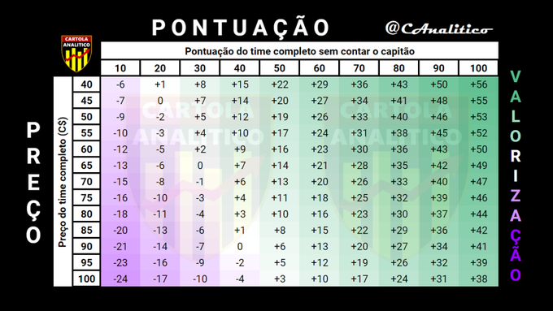

### Rodada 1

Esta é a rodada que, principalmente os iniciantes, acabam comprometendo demais
seu patrimônio, por não conhecerem muito o processo de valorização. Nesta rodada,
os jogadores mais caros tendem a se aproximar da média do mercado, para que ele
possa se estabilizar aos poucos, pois não pode haver uma grande diferença de valor
entre os jogadores, por isso, os jogadores mais caros tendem a ter o seu preço reduzido,
e os mais baratos tendem a ter uma boa valorização. Com essa regrinha básica, já é
possível escalar o seu time sem problemas. Procure apostar em jogadores com o valor
abaixo de **¢10 Cartoletas**, até alguns abaixo de **¢5**, pois não necessitam de
grandes pontuações para valorizar.

Outra forma de definir um bom time é se basear no preço total. Abaixo segue uma
tabela para te ajudar a calcular quanto é preciso para valorizar. Pela tabela,
criada pelo [@CAnalitico](https://twitter.com/CAnalitico), podemos ver que, se
seu time fizer 60 pontos (sem contar o capitão), ele irá valorizar sempre.

Alguns exemplos:

- Se seu time custou **¢60 Cartoletas**, e você fez **90 pontos**, sua valorização
    será cerca de **43**.
- Se seu time custou **¢90 Cartoletas**, e você fez apenas **20 pontos**, seu time
    irá desvalorizar **-14**.
- Se seu time custou **¢80 Cartoletas**, e você fez **60 pontos**, sua valorização
    será cerca de **16**.

#### Referências

- [CartolaFC10 - Sistema de valorização 2019](https://cartolafc10.com.br/index.php/sistema-de-valorizacao-2019/)
- [CartolaFC Brasil - Sistema de Valorização do Cartola FC nas Primeiras Rodadas](https://www.cartolafcbrasil.com.br/tutoriais/5/sistema-de-valorizacao-do-cartola-fc-nas-primeiras-rodadas)
- [CartolaAnalitico @CAnalitico - Twitter](https://twitter.com/CAnalitico/status/1288101183211671554)
