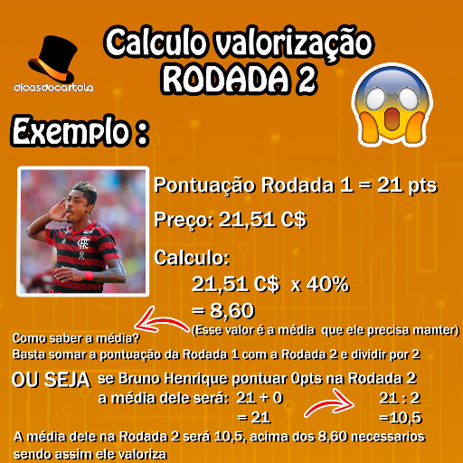

### Rodada 2

Nesta rodada, começamos a contar com o fator média do jogador, que é um fator
muito importante para que você possa entender o processo de valorização. Ele
funciona com base na média do jogador em relação a seu valor, ou seja, ele precisa
atingir uma média de mais ou menos a metade do seu valor para valorizar (Não existe
preço exato, mas normalmente é um valor próximo da metade do seu valor). Após essa
regrinha básica, aposte nos jogadores que pontuaram **bem** na primeira rodada, e que
tiveram as maiores valorizações no fantasy game. Faça um calculo básico de quanto
ele precisaria para atingir uma média de mais que a metade do seu valor, se ele não
precisar pontuar demais para atingir esta média, este jogador se torna uma ÓTIMA
aposta para a rodada. **Evite apostar em jogadores que desvalorizaram na primeira rodada.**

#### Exemplo

#### Referências

- [CartolaFC10 - Sistema de valorização 2019](https://cartolafc10.com.br/index.php/sistema-de-valorizacao-2019/)
- [CartolaFC Brasil - Sistema de Valorização do Cartola FC nas Primeiras Rodadas](https://www.cartolafcbrasil.com.br/tutoriais/5/sistema-de-valorizacao-do-cartola-fc-nas-primeiras-rodadas)
- [Blog do Guru - Como valorizar e ganhar cartoletas no Cartola FC 2019](https://gurudocartola.com/blog/como-valorizar-e-ganhar-cartoletas-no-cartola-fc-2019/)
- [Dicas do Cartola - Valorização na Rodada 2: Como Ganhar Cartoletas](https://www.dicascartola.com.br/como-jogar-cartola-fc/valorizacao-cartola-fc-2-rodada/)
